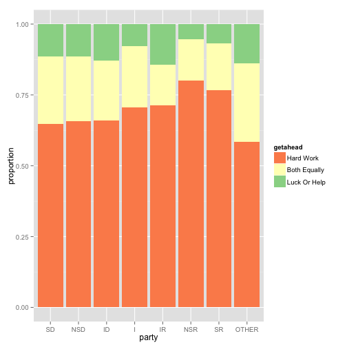

Belief in hard work 
========================================================
Introduction
The belief in hard work as a way to improve one's standing in life is a long time "American" value. I am interested in how this value changes across different subsections of the population. For this study, I will use the General Social Survey (GSS) data from 2012 to analyze how the belief in hard work as a way to get ahead varies according to one's affiliation with a political party. For the purposes of this essay, I will refer to the two variables as "belief in hard work", and "political party" respectively. 

The GSS assesses the belief in hard work by asking the following question:   "Some people say that people get ahead by their own hard work; others say that lucky breaks or help from other people are more important. Which do you think is most important?"  The possible responses are:

- Hard Work
- Both equally
- Luck or help
- other
- Don't know
- NA

The breakdown of the 2012 respondents can be seen in the following table:

```r
load(url("http://bit.ly/dasi_gss_data"))
gss12 <- subset(gss, gss$year=="2012")
table(gss12$getahead)
```

```
## 
##    Hard Work Both Equally Luck Or Help        Other 
##          910          264          128            0
```
The next table shows the same information as proportions of the total number of respondents:

```r
prop.table(table(gss12$getahead))
```

```
## 
##    Hard Work Both Equally Luck Or Help        Other 
##      0.69892      0.20276      0.09831      0.00000
```
The GSS assesses political party affiliation by asking, "Generally speaking, do you usually think of yourself as a Republican, Democrat, Independent, or what?"  The possible responses are:  
- Strong Democrat
- Not Strong Democrat
- Independent, near Dem
- Independent
- Independent, near Rep
- Not Strong Republican
- Strong Republican
- Other party
- Don't know

The breakdown of 2012 respondents is as follows:

```r
table(ggss12$partyid)
```

```
## Error: object 'ggss12' not found
```
As proportions of total respondents: 

```r
prop.table(table(gss12$partyid))
```

```
## 
##    Strong Democrat   Not Str Democrat       Ind,Near Dem 
##            0.18163            0.17500            0.11990 
##        Independent       Ind,Near Rep Not Str Republican 
##            0.19031            0.08010            0.12755 
##  Strong Republican        Other Party 
##            0.09796            0.02755
```
The null hypothesis, H0, is that there is no relationship between belief in hard work and political party affiliation. In which case, the breakdown of belief in hard work as a function of political party affilitation should mirror the breakdown of political party affiliation. In other words, of the people who believe in hard work, approximately 18% should be strong Democrats, 18% not strong Democrats, 12% Independent, near Democrats, and so on. Furthermore, the breakdown of political party as a function of belief in hard work should mirror the breakdown of the belief in hard work. For each political party affiliation, approximately 70% should believe in hard work, 20% should believe in both hard work and luck or help and 10% should believe in lucky breaks or help. 

The alternative hypothesis, HA, is that there is a relationship between belief in hard work and political party affiliation. 

##Exploratory Analysis
A preliminary analysis suggests that there is a relationship between hard work and political party affiliation, or that we might reject the null hypothesis in favor of the alternative hypothesis. 

A breakdown of the belief in hard work as a function of political party shows that people who identify as Democrats are underrepresented amongst the people who believe in hard work and people who identify as Republicans are slightly overrepresented amongst the people who believe in hard work. Conversely, people who identify as Democrats are overrepresented amongst the people who believe in "both equally" and " luck or help", while Republicans are underrepresented in these categories. 

The same tendencies can be seen in the breakdown of political party affiliation as a function of belief in hard work. Proportionally, more Republicans believe in hard work as the way to get ahead than Democrats, Independents or people who identify as other. 


```r
prop.table(table(gss12$partyid, gss12$getahead), 1)
```

```
##                     
##                      Hard Work Both Equally Luck Or Help   Other
##   Strong Democrat      0.64831      0.23729      0.11441 0.00000
##   Not Str Democrat     0.65611      0.23077      0.11312 0.00000
##   Ind,Near Dem         0.65957      0.21277      0.12766 0.00000
##   Independent          0.70472      0.21654      0.07874 0.00000
##   Ind,Near Rep         0.71429      0.14286      0.14286 0.00000
##   Not Str Republican   0.80000      0.14545      0.05455 0.00000
##   Strong Republican    0.76692      0.16541      0.06767 0.00000
##   Other Party          0.58333      0.27778      0.13889 0.00000
```

```r
library(ggplot2)
bypartypropdf <- as.data.frame(prop.table(table(gss12$partyid, gss12$getahead),1))
colnames(bypartypropdf) <- c("party", "getahead", "prop")
g6 <- ggplot(bypartypropdf, aes(x=party, y=prop, group=getahead, color=getahead))+geom_bar(stat="identity")
g6
```

 


